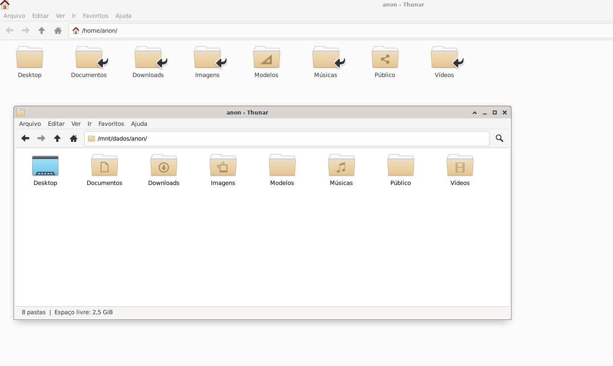

# criar_links_home

Criar links simbólicos (atalhos) das principais pastas do seu usuário (como Documentos, Downloads, Imagens, etc.) para uma 
outra partição/disco, de forma que o sistema continue funcionando normalmente, mas os dados fiquem armazenados em outro lugar.

Objetivo

Mover as pastas do usuário (Documentos, Downloads, Imagens, Música, Vídeos, etc.) para outra partição (por exemplo /mnt/dados) e 
criar links simbólicos (ln -s) para elas no /home/usuario.

Suponha:

Seu usuário é goku

Sua partição de dados está montada em /mnt/dados

Você quer mover o conteúdo de ~/Documentos ~/Downloads ~/Imagens ~/Música ~/Vídeos para lá

Resultado:

Documentos -> /mnt/dados/goku/Documentos
Downloads  -> /mnt/dados/goku/Downloads
Imagens    -> /mnt/dados/goku/Imagens
Música     -> /mnt/dados/goku/Música
Vídeos     -> /mnt/dados/goku/Vídeos

Procedimento no Windows:
https://youtu.be/vrS3iviGDFY?t=272

